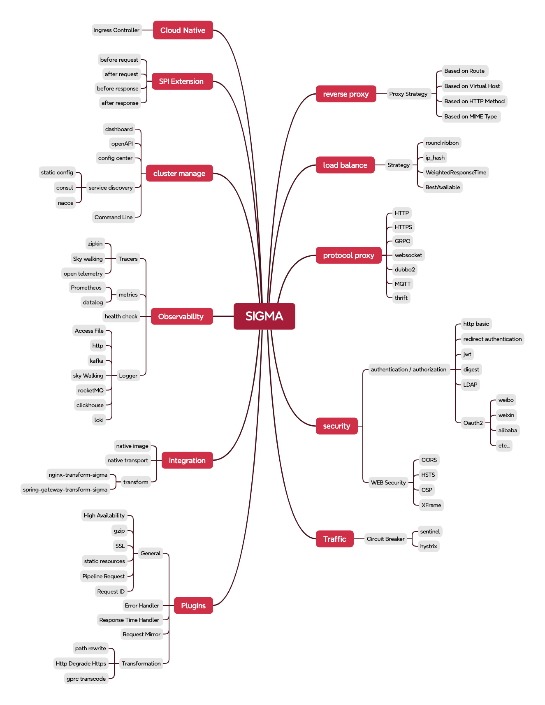

# SIGMA

一个基于Vertx(netty)的高性能网关,可以以二进制文件执行.

# 功能列表

1. **Route**
2. **Upstream**
3. **reverse-proxy**
4. **Load balance**

5. **plugin**

# 路线图



# 里程碑

- 2024-10-08 the version 0.1.0-alpha is done.

# 基准测试

## 测试环境

Apple M1 Pro(10 vCPUs, 16 GB memory)

## 反向代理测试

仅使用Sigma作为反向代理服务,含路由改写插件,不使用日志打印和其他插件.

## QPS

因为M1 pro的CPU架构,没有超线程技术,所以,本次测试使用4个核心给wrk,4个核心给sigma反向代理服务,2个cpu给下游服务,下游服务仅返回一个简单的JSON:

```json
{
  "code": 200,
  "msg": "success",
  "data": null
}
```

### Upstream(在8888和8889端口)

```wiki
~ % wrk -t8 -c2000 -d30s http://localhost:8888
Running 30s test @ http://localhost:8888
  8 threads and 2000 connections
  Thread Stats   Avg      Stdev     Max   +/- Stdev
    Latency     1.60ms    2.70ms 129.17ms   95.30%
    Req/Sec    17.01k     5.87k   31.22k    68.83%
  4070138 requests in 30.09s, 322.17MB read
  Socket errors: connect 1756, read 161, write 0, timeout 0
Requests/sec: 135264.76
Transfer/sec:     10.71MB
```

### Nginx(在8081端口):

```wiki
~ % wrk -t8 -c2000 -d1m http://localhost:8081
Running 1m test @ http://localhost:8081
  8 threads and 2000 connections
  Thread Stats   Avg      Stdev     Max   +/- Stdev
    Latency     3.74ms    2.32ms 135.17ms   95.69%
    Req/Sec     8.20k     2.99k   16.62k    67.24%
  3908370 requests in 1.00m, 547.91MB read
  Socket errors: connect 1756, read 227, write 15, timeout 0
  Non-2xx or 3xx responses: 28
Requests/sec:  65119.80
Transfer/sec:      9.13MB
```

### Sigma(在80端口,路由改写 /test/* 为 /):

```wiki
~ % wrk -t8 -c2000 -d1m http://localhost/test/benchmark   
Running 1m test @ http://localhost/test/benchmark
  8 threads and 2000 connections
  Thread Stats   Avg      Stdev     Max   +/- Stdev
    Latency     3.53ms    2.13ms 137.37ms   88.09%
    Req/Sec     8.55k     2.83k   14.77k    70.42%
  4087162 requests in 1.00m, 654.83MB read
  Socket errors: connect 1756, read 189, write 0, timeout 0
Requests/sec:  68079.91
Transfer/sec:     10.91MB
```

> 尽管Sigma只在一些场景下性能表现比Nginx要略好一些,但是它仍然非常快而且有很大的改进空间.

# 贡献

我们欢迎为Sigma做出贡献！如果您有任何idea、suggestion或bug reports，请随时open issue或提交pull request。