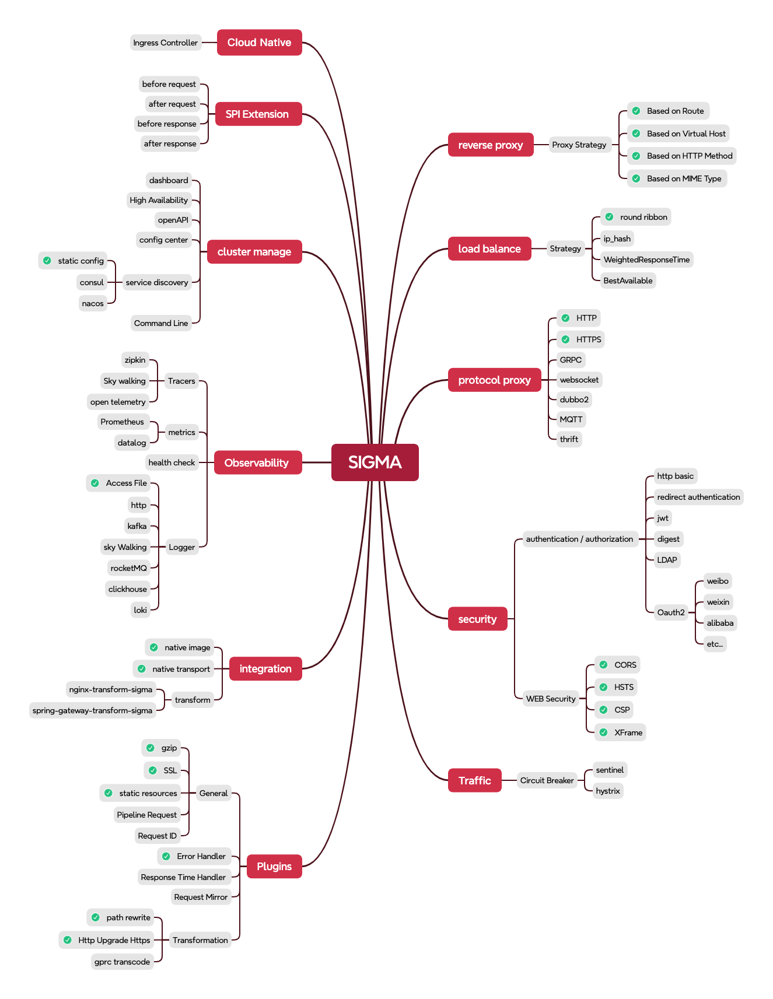

# SIGMA

## 介绍

Sigma是一个基于Vertx(netty)的高性能网关，可以以二进制文件执行，它有如下特性:

### [Based on vertx](https://vertx.io/)

Vertx是一个非常优秀的异步网络框架，它提供了众多开箱即用的功能。得益于Vertx完善的生态，Sigma可以用极小的代价得到极高的性能。

以下是Sigma使用的Vertx模块：

- vertx core
- vertx web
- vertx http proxy
- vertx io_uring

### [Vertx io_uring](https://vertx.io/docs/vertx-io_uring-incubator/java/)

> 在Linux Kernel 5.1中，添加了新的io_uring接口，它是一个用于完全异步Linux系统调用的高性能I/O可扩展接口。

> 而Vert.x io_uring就是一个使用Linux内核里io_uring接口的传输模型，它基于Netty io_uring,

可以到[Github Project](https://github.com/netty/netty-incubator-transport-io_uring)中去查看详细信息。

**Sigma借助了Vertx io_uring以提高IO性能。**

### [Native transports](https://netty.io/wiki/native-transports.html)

> Vertx可以在BSD(OSX)和Linux系统上使用native transports运行(可用时)，与基于NIO的传输相比，这些JNI传输添加了特定于特定平台的功能，产生的垃圾更少，通常可以提高性能。

**Sigma借助Native transport提高了数据传输速度，当然，它只能作用于部分Linux和BSD系统上，好在大部分的服务都运行在这些系统上。**

### [GraalVM native image](https://www.graalvm.org/latest/reference-manual/native-image/)

> GraalVM Native Image是一种将Java代码提前编译为二进制文件（即本机可执行文件）的技术

当以本机可执行文件运行应用时，相比于传统的Java运行方式，它将拥有更快地启动速度，更小的打包体积，更小的运行时内存占用等优势。

**Sigma可以以二进制文件的方式执行，以适应云原生时代。**

**警告:**

通过检查 [Github actions runner image](https://github.com/actions/runner-images?tab=readme-ov-file) 中的预装软件和
[GraalVM Native image prerequisites](https://www.graalvm.org/latest/reference-manual/native-image/#prerequisites)
的要求，我们发现github action runner 的windows-latest image中缺少了Windows 11的SDK，如果需要用到windows平台的Sigma二进制文件，请根据文档自行编译，或者使用Jar包的方式部署Sigma。

### [Java virtual thread](https://openjdk.org/jeps/444)

> 虚拟线程不是更快的线程——它们运行代码的速度并不比平台线程快。它们的存在是为了提供规模（更高的吞吐量），而不是速度（更低的延迟）。它们的数量可能比平台线程多得多，因此根据利特尔定律，它们能够实现更高吞吐量所需的更高并发。

对IO密集型的任务而言，负载通常不受CPU限制，在这种情况下，即使线程数多于内核数也无法提高吞吐量。

> 虚拟线程有助于提高传统服务器应用程序的吞吐量，因为这些应用程序由大量并发任务组成，这些任务花费了大量时间在线程等待上。

区别于OS线程模型(通常通过线程池管理，以减少创建线程的开销，并重用线程)，虚拟线程虽然没有提供更低的延迟，但提供了更高的吞吐量。

**得益于Vertx对虚拟线程的支持，Sigma因此拥有了优秀的并发性能。**

## 功能列表

1. **Route**
2. **Upstream**
3. **reverse-proxy**
4. **Load balance**
5. **plugin**

## 路线图



## 里程碑

- 2024-10-08 the version 0.1.0-alpha is done.

## 基准测试

### 测试环境

Apple M1 Pro(10 vCPUs, 16 GB memory)

### 反向代理测试

仅使用Sigma作为反向代理服务,含路径改写插件,不使用日志打印和其他插件.

### QPS

因为M1
pro的CPU架构,没有超线程技术,所以,本次测试使用4个核心给wrk,4个核心给sigma反向代理服务,2个核心给下游服务,下游服务仅返回一个简单的JSON:

```json
{
  "code": 200,
  "msg": "success",
  "data": null
}
```

#### Upstream(在8888和8889端口)

```wiki
~ % wrk -t8 -c2000 -d30s http://localhost:8888
Running 30s test @ http://localhost:8888
  8 threads and 2000 connections
  Thread Stats   Avg      Stdev     Max   +/- Stdev
    Latency     1.60ms    2.70ms 129.17ms   95.30%
    Req/Sec    17.01k     5.87k   31.22k    68.83%
  4070138 requests in 30.09s, 322.17MB read
  Socket errors: connect 1756, read 161, write 0, timeout 0
Requests/sec: 135264.76
Transfer/sec:     10.71MB
```

#### Nginx(在8081端口):

```wiki
~ % wrk -t8 -c2000 -d1m http://localhost:8081
Running 1m test @ http://localhost:8081
  8 threads and 2000 connections
  Thread Stats   Avg      Stdev     Max   +/- Stdev
    Latency     3.74ms    2.32ms 135.17ms   95.69%
    Req/Sec     8.20k     2.99k   16.62k    67.24%
  3908370 requests in 1.00m, 547.91MB read
  Socket errors: connect 1756, read 227, write 15, timeout 0
  Non-2xx or 3xx responses: 28
Requests/sec:  65119.80
Transfer/sec:      9.13MB
```

#### Sigma(在80端口,路由改写 /test/* 为 /):

```wiki
~ % wrk -t8 -c2000 -d1m http://localhost/test/benchmark   
Running 1m test @ http://localhost/test/benchmark
  8 threads and 2000 connections
  Thread Stats   Avg      Stdev     Max   +/- Stdev
    Latency     3.53ms    2.13ms 137.37ms   88.09%
    Req/Sec     8.55k     2.83k   14.77k    70.42%
  4087162 requests in 1.00m, 654.83MB read
  Socket errors: connect 1756, read 189, write 0, timeout 0
Requests/sec:  68079.91
Transfer/sec:     10.91MB
```

尽管Sigma只在一些场景下性能表现比Nginx要略好一些,但是它仍然非常快而且有很大的改进空间.

## 贡献

我们欢迎为Sigma做出贡献！如果您有任何idea、suggestion或bug reports，请随时open issue或提交pull request。